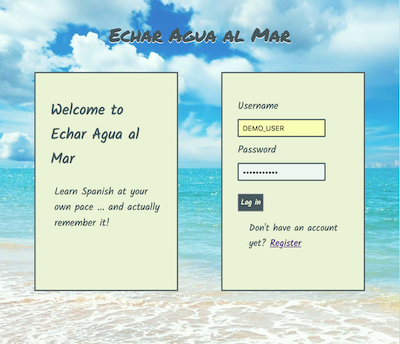

# Echar Agua Al Mar

## Table of Contents

- [App Description](#app-description)
- [Link to Deployed Version](#deployed-version)
- [Demo user accounts](#demo-accounts)
- [App Screenshots](#app-screenshots)
- [Tech Stack Description](#tech-stack-description)
- [Key Parts in the Codebase](#key-parts-in-the-codebase)
- [Reuse Instructions](#reuse-instructions)

## App Description

This is an app that helps users learn Spanish. Users start with a deck of 10 Spanish words, and can add even more!

- Users can create an account that will keep track of the cards they have added and their accuracy of each word. 

- Users can add their own cards to practice words they want to learn.

- This app uses spaced repetition so that users will see the words they miss will appear more often. Words the user knows well will not appear as often.

## Deployed App

The deployed version of this app can be found [here](https://spaced-repetition-cc.herokuapp.com/)

Additionally, here is a link to the [server-side repository](https://github.com/thinkful-ei24/colin-cameron-spaced-repetition-server)

## Demo Accounts
Here is a demo account:
- username: DEMO_USER
- password: password123 

## App Screenshots
**Login Page:**

**Main Dashboard:**

**Add a Flashcard:**

**User Progress:**

## Tech Stack Description
The frontend of the app uses React and Redux. React-router-DOM is used for routing and redirecting. 

The backend uses Node, Express, and a Mongo database. Passport is used for authentication.

## Key Parts in the Codebase
- The spaced repetition algorithm is implemented as a method on the User schema, found on the server side in file `/models/users.js`.

## Reuse Instructions

In order to reuse this app, the developer should have Node installed. Clone the server and client side repos and run `npm install` on both. 

This project was bootstrapped with [Create React App](https://github.com/facebook/create-react-app).